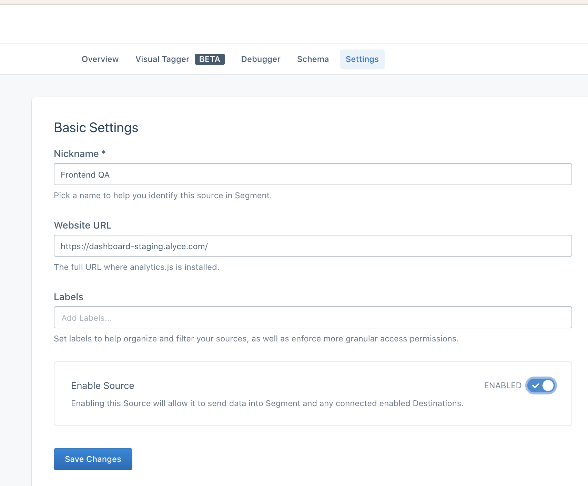

# Analytic events

## Table of Contents
1. [Analytics](#analytics-segment)
    - [Sending event from component](#sending-event-from-component-using-hook)
    - [Sending event from RxJS epic](#sending-event-from-rxjs-epic-using-action-creator)
    - [Debug in Segment side](#debug-event-in-segment)
    - [Working with requirements](#working-with-requirements)

## Analytics (Segment)

### Sending event from component using hook

Example:
```js
import React, { useCallback } from 'react';
import { TrackEvent } from '@alycecom/services';

export const AwesomeButton = () => {
  const [count, setCount] = useState(1);
  const { trackEvent } = TrackEvent.useTrackEvent();

  const onAwesomeButtonClick = useCallback(
    () => {
      setCount(
        currentCount => {
          trackEvent('Awesome button click', { count })
          return currentCount + 1;
        }
      );
    },
    [trackEvent]
  );

  return <button onClick={onAwesomeButtonClick}>Click me!</button>
};
```

API
```ts
const trackEvent: (eventName: string, payload?: object, options?: object) => void = useTrackEvent();
```

 - eventName `Required` - Segment event name
 - payload `Optional` - Additional event details
 - options `Optional` - Here you can add or override event context
    - options.traits `Optional` - Here you can override event traits
 
## Sending event from RxJS Epic using action creator

Example:
```js
import { ofType } from 'redux-observable';
import { map } from 'rxjs/operators';
import { TrackEvent } from '@alycecom/services';

import { AWESOME_ACTION } from './awesomeActions.types';

export const eventOnAwesomeActionEpic = action$ =>
  action$.pipe(
    ofType(AWESOME_ACTION),
    map(({ payload: awesomeValue }) =>
      TrackEvent.actions.trackEvent({
        name: 'Awesome action dispatched',
        payload: { awesomeValue },
      }),
    ),
  );
```

API:
```ts
type TrackEventPayload = {
  name: string, // Segment event name
  payload?: Object // Additional event details
  options?: Object // Here you can add or override event context
};
```

### Working with requirements

Requirements example:

- **Event name:** Activate campaign default product - Selected
- **Event context:**
    - group_id - the organization id
- **Event properties**
    - campaign_id
    - product_id
- **Event traits**
    - admin_id - id of Alyce admin if login-as has been used here
    
Example of implementation:
```js
import React, { useCallback } from 'react'
import { TrackEvent } from '@alycecom/services';

// ...
const { trackEvent } = TrackEvent.useTrackEvent();

const onSelectProduct = useCallback(
  (campaignId, productId, orgId, adminId) => {
    trackEvent(
      'Activate campaign default product - Selected',
      { campaign_id: campaignId, product_id: productId },
      { group_id: orgId, traits: { admin_id: adminId } }
    );
  },
  [trackEvent]
);
//...
```
    
### Debug event in Segment
1. Open [app.segment.com](https://app.segment.com/)
and click on `Alyce` workspace
2. Chose `Javascript` connection
    
3. Choose a source where you want to check an event
    
4. Proceed to `settings` and make sure the source enabled
    
5. Proceed to `debug`.
    
